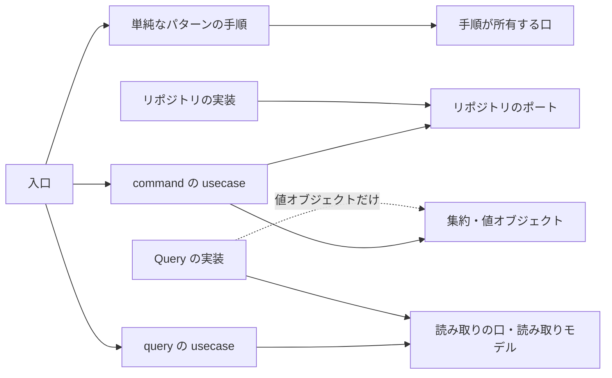

# apply-layer-convention

処理ごとに実装パターンを選び、責務の持ち主と整合性の守り方を言語に依らずに決めて、コードへ当てる。ここにあるのは一般則で、各言語の規約はそれを自分の言語の形へ写すだけにする。資料に無いことは推測で補わない（`develop-inside-out` の規律）。集約と状態の切り方、並行実行で要る保証、分離レベルとやり直し、技術的な処理のライフサイクルは資料を作る側が決め、ここではそれを写す位置だけを決める。

## パターンは業務知識の複雑さで選ぶ

拒否があるかどうかでは選ばない。拒否はどんな処理にもあり、それだけで集約を作ると、状態を持たない処理に空の型が並ぶからである。問いは二つで、どちらかに当たれば戦術的 DDD で書く。一つ目は、状態によって受ける操作が変わるか（状態遷移図に複数の状態があり、コマンドごとに受ける状態が決まっているか）。二つ目は、複数の値や事実にまたがる不変条件を、自分の状態と受け取った材料から判断するか。

どちらにも当たらない処理は、単純なパターン（トランザクションスクリプト）で書く。usecase の手順が、DB へのアクセスを受け持つ口（リポジトリ相当）を順に呼び、集約も状態ごとの型も作らない。値の形の検証、DB の制約で守れる拒否、存在しないことによる拒否だけの処理はこちらに入る。要求、回収、完了の段階を持つ処理でも、それが業務の状態ではなく技術的な処理のライフサイクルなら単純なパターンである。

どちらのパターンでも、値は値オブジェクトで組み立て、DB へのアクセスはリポジトリ相当の口に置き、手順とトランザクションの境界は usecase が持つ。技術的な処理の途中で業務の判断が要るなら、発生元の集約のコマンドで確定させ、要求に載せて運ぶ。手順が分岐してよいのは、処理の段階、要求が運んだ閉じた値、エラーの処理の表だけである。

## 責務は一つの持ち主に置き、依存は外から内へ向ける

入口は、RPC の handler、メッセージの受信、ワーカーの巡回のように、外からの要求を受けて usecase を呼ぶところである。ドメインは永続化、転送の形式、時計、採番を知らない。「共通」「サービス」「ヘルパー」のような、持ち主を決めない置き場へ逃がさない。

書き込みは集約を復元して操作し、リポジトリから保存する。一覧、件数、検索、存在確認は、query の usecase が所有する読み取りの口と平らな読み取りモデルに置き、Query の実装が満たす。Query の実装は集約を復元しない。これを破る指定（一覧をリポジトリへ置く、Query で集約を復元する）は、別の責務へ置き換えずに `query_role_conflict` として返して止まる。

## command は、見つける、一回呼ぶ、適用するだけにする

command の usecase は、リポジトリの Find で集約（生成なら初期状態の集約）を得て、コマンドを一回呼び、結果のイベントをリポジトリの Apply で保存する。判断の材料（ほかの集約から集めた事実）は Find が読んで初期状態の集約へ持たせ、Find は読むだけで判断しない。usecase は読み取りの口を呼ばず、状態を見て分岐しない。材料を usecase が集めると、集めるための分岐が usecase に入り、材料と保存が同じトランザクションで読まれる保証も崩れるからである。受けない状態の拒む理由が資料に無ければ、その command は書かずに資料の持ち主へ返す。

外から来たプリミティブは、入口で値オブジェクトへ一度だけ変換する。業務の時刻は入口が時計から一度だけ取ってコマンドへ渡し、巡回なら一回の巡回の始めに一度だけ取って全件に同じ値を渡す。業務が時刻を決めない出来事の時刻は、リポジトリが記録のときに一度だけ取る。応答に返す識別子は usecase が採番してコマンドへ渡し、採番はトランザクションの外で行う（やり直しても同じ識別子を使うため）。

## 不変条件は三つの置き場に分け、トランザクションは usecase が張る

構造の条件（一つの値が有効である条件）は値オブジェクトの生成が守る。事前条件（操作の時点の状態と材料で決まる条件）は集約のコマンドが判断する。集合の条件（一意、参照、同時の書き込みにまたがる条件）は DB の宣言的な制約が守り、リポジトリが違反を業務の拒否へ翻訳する。選んだ DB で制約を宣言できないなら、ロックなどの代わりを発明せずに止まる。

トランザクションは usecase が張り、リポジトリと口は渡されたトランザクションの上で動くだけにする。分離レベルとやり直しは物理設計の資料が操作ごとに決めたものを渡し、既定に頼らない。指定が無ければ物理設計の資料へ返す。

## 後続の処理は Outbox で分け、同じ時点が要るときだけ横断の command にする

一つの command が書く集約は一つを基本にする。通知の送信、投稿の後のタイムラインの更新のように、同期で行うと外部の遅延や失敗が業務の変更まで止める処理は、Outbox で非同期にする。発生元の変更と要求の記録を同じトランザクションで保存し、単純なパターンの手順が別のトランザクションで要求を回収して処理する。資料が二つの集約を同じ時点で成立させると定めたときだけ、一つのトランザクションで二つを書く横断の command を置き、先のコマンドの結果を値として次のコマンドへ渡す。同じ時点か別の時点かが資料に無ければ、推測せずに問う。

外部との通信を挟む手順では、外部への通信をトランザクションの外に置き、処理を冪等にし、進捗を一件ごとのトランザクションで確定させる。

## 失敗の影響は、全体に及ぶかどうかの一つの基準で閉じ込める

複数の件を順に処理する場面（巡回、一件ずつの発行、一覧）で、一件に閉じた失敗（業務の規則に反する、同時更新で競合した、その行の破損）は記録して次へ進み、全体に及ぶ失敗（依存先が利用できない、時間切れ）は残りを試さずに打ち切る。どの分類がどちらかは、各言語のエラーの規約の表が持つ。利用者へ返す一覧では壊れた一件だけを除いて記録し、残りを返す。作業待ちの行（Outbox の要求）は黙って除かず、ライフサイクルが定める終わり方で記録する。

巡回の相手が command なら、巡回（入口）が query で候補を選び、一件ずつ command を呼び、ループと閉じ込めを持つ。相手が単純なパターンの手順なら、ループと閉じ込めは手順が持ち、巡回は手順を一度呼ぶだけにする。両方に書くと、閉じ込めと記録が二重になる。

## 止まるとき

対象の責務を識別できないとき、責務がどの持ち主にも当たらないとき、`query_role_conflict` のとき、集合の条件を DB で宣言できないとき、資料が曖昧でパターン、集約の境界、後続の処理の時点、物理設計の指定のどれかが一つに決まらないときは止まり、決まらない点と提案と根拠の資料を返す。業務知識もドメインモデルも状態について何も書いていないときだけ、パターンが決まらないとして止まる。

実装の変更を依頼されたときだけコードを直し、依存の検査、ビルド、対象のテストを通す。判断だけの依頼なら、処理ごとのパターンとその根拠、責務の持ち主、トランザクションの境界、Outbox の有無、閉じ込める範囲を返す。

## 例

図書館の貸出は、貸出中、延滞、返却済みで受ける操作が変わるので戦術的 DDD になる。本を借りる command では、Find が利用者の貸出状況を読んで初期状態の貸出へ持たせ、コマンドが上限と延滞を判断する。延滞の通知の回収と発行は段階を持つが技術的な処理のライフサイクルなので、単純なパターンになり、延滞にする command が同じトランザクションで通知の要求を記録する。反例は、延滞の候補を読む query を延滞にする usecase の中で呼び、件数を見て分岐する形である。同じ本を二人が同時に借りる場面は集約のコマンドでは拒めないので、部分一意の制約が守り、リポジトリが業務の拒否へ翻訳する。
