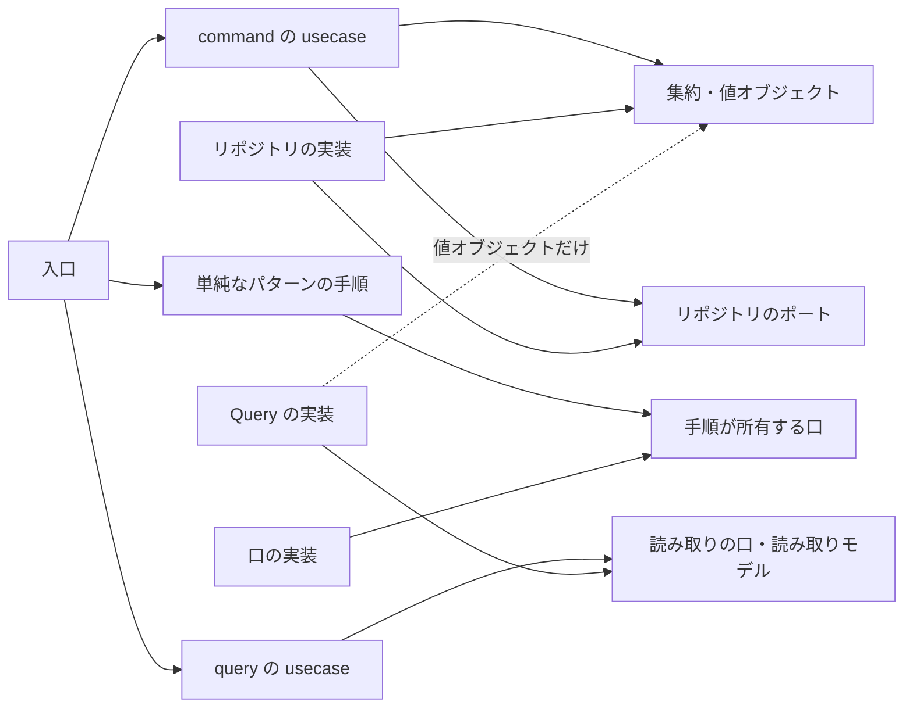

# 責務と整合性の判断

この資料は、実装パターン、責務の持ち主、依存の向き、整合性の置き場を決めるときの根拠と例である。題材は図書館の貸出で、利用者は本を借りて返し、一人が同時に借りられる冊数には上限がある。延滞になると、利用者へ通知を送る。

# パターンは業務知識の複雑さで選ぶ

パターンは、Learning Domain-Driven Design の考え方に沿って、処理が持つ業務知識の複雑さで選ぶ。拒否があるかどうかでは選ばない。拒否はどんな処理にもあり、それだけで集約を作ると、状態を持たない処理に空の型が並ぶからである。

状態によって受ける操作が変わる処理は、状態ごとの型に操作を持たせると、受けない状態を型が拒む。usecase が状態を調べて分岐する必要が無くなる。複数の値や事実にまたがる不変条件を判断する処理は、判断を集約の一か所に置くと、同じ判断が入口や usecase に散らばらない。この二つの利点が要らない処理に、戦術的 DDD の型を持ち込まない。

単純なパターンでも、値は値オブジェクトで組み立て、DB へのアクセスはリポジトリ相当の口に置き、手順とトランザクションの境界は usecase が持つ。パターンを単純にしても、値の検証と保存の置き場は変えない。

技術的な処理の途中で業務の判断が要るなら、その判断は発生元の集約のコマンドで確定させ、要求に載せて運ぶ。技術的な処理の手順が分岐してよいのは、処理の段階と、要求が運んできた閉じた値と、失敗の扱いの表だけである。

# 依存は外から内へ向く

矢印は論理の依存で、言語の import や配置を示さない。ドメインは、永続化、転送の形式、時計、採番を知らない。Query の実装は値オブジェクトを借りてよいが、集約を復元しない。command の usecase は読み取りの口に依存しない。

# command は、見つける、一回呼ぶ、適用する

command の usecase は、リポジトリの Find で集約（または初期状態の型）を得て、コマンドを一回呼び、結果のイベントをリポジトリの Apply で保存する。判断の材料は Find が集める。本を借りるなら、Find が利用者の貸出状況（借りている冊数と延滞の有無）を読み、初期状態の貸出に持たせて返す。Find は読むだけで、上限に達しているかを判断しない。判断するのは、初期状態の貸出の「本を借りる」である。

材料を usecase が読み取りの口で集めると、材料を集めるための分岐と逐次の呼び出しが usecase に入り、材料と保存が同じトランザクションで読まれる保証も崩れる。受けない状態の拒む理由が資料に無ければ、状態ごとの型が閉じないので、その command は書かずに資料の持ち主へ返す。

# 入力、時刻、採番

外から来たプリミティブは、入口で値オブジェクトへ一度だけ変換する。usecase もドメインも、変換と検証を繰り返さない。

業務の時刻（本を借りた時点、延滞を判定した時点）は、入口が時計から一度だけ取ってコマンドへ渡す。巡回なら、一回の巡回の始めに一度だけ取り、その巡回のすべての件に同じ値を渡す。業務が時刻を決めない出来事（本を返した時点）は、リポジトリが記録のときに時計から一度だけ取る。

応答に返す識別子は、usecase が採番してコマンドへ渡す。採番はトランザクションの外で行い、トランザクションがやり直されても同じ識別子を使う。

# 不変条件の三つの置き場

構造の条件は、一つの値が有効であるための条件で、値オブジェクトの生成が守る。借りている冊数が負にならないことがこれにあたる。

事前条件は、操作の時点の状態と材料で決まる条件で、集約のコマンドが判断する。延滞の貸出がある利用者は借りられない、がこれにあたる。

集合の条件は、同時に走る複数の書き込みにまたがる条件で、DB の宣言的な制約が守る。同じ本の貸出中の貸出は一つだけ、がこれにあたり、部分一意の制約の違反を、リポジトリが「貸出中の本を借りる」へ翻訳する。同じ利用者が同時に二冊借りて上限を超えないことは、物理設計が決めた分離レベルで守る。どう守るかは物理設計が決め、実装はその指定を渡す。

# トランザクションと Outbox

トランザクションは usecase が張る。リポジトリとリポジトリ相当の口は、渡されたトランザクションの上で動き、自分では張らない。張るかどうかを口ごとに変えると、どこで確定したかを手順から読めなくなる。

一つの command が書く集約は一つを基本にする。延滞にした後に利用者へ通知を送るように、後続の処理が別の時点でよいなら、Outbox を使う。延滞にする command が、延滞の記録と同じトランザクションで通知の要求を記録する。単純なパターンの手順が、別のトランザクションで要求を回収し、トランザクションの外で送り、送ったことを一件ごとのトランザクションで記録する。外部の遅延や失敗が、延滞にする処理を止めない。

資料が二つの集約を同じ時点で成立させると定めたときだけ、一つのトランザクションで二つを書く横断の command を置く。先の集約のコマンドの結果を、値として次の集約のコマンドへ渡す。プロセスの中のイベントバスは使わない。

# 失敗の影響を閉じ込める

複数の件を順に処理するとき、一件の失敗で残りを止めるかは、その失敗が全体に及ぶかで決める。業務の規則に反する、同時更新で競合した、その行が壊れている、は一件に閉じるので、記録して次の一件へ進む。依存先が利用できない、時間切れ、は残りも同じ理由で失敗するので、打ち切って返す。DB が落ちているときに全件を試して、同じ失敗を件数だけ記録しないためである。

利用者へ返す一覧では、壊れた一件だけを除いて記録し、残りを返す。作業待ちの行は黙って除かない。除くと、その要求は永久に処理されないからである。

# 例

典型例：本を借りる command は、Find が貸出状況を読み、初期状態の貸出の「本を借りる」が上限と延滞を判断し、Apply が貸出と出来事を記録する。usecase は分岐を持たない。

似て非なる例：延滞の通知の回収と発行は段階を持つが、それは技術的な処理のライフサイクルなので単純なパターンである。業務の判断（誰に知らせるか）は延滞にする command で確定し、要求に載っている。

反例：本を借りる usecase が、読み取りの口で借りている冊数を数え、5冊以上なら拒否を返す。判断が usecase に入り、集約の判断と二か所になる。

境界例：同じ本を二人が同時に借りる場面は、集約のコマンドでは拒めない。二つの貸出はそれぞれ正しく生まれるからで、集合の条件として DB の制約が守り、リポジトリが業務の拒否へ翻訳する。
