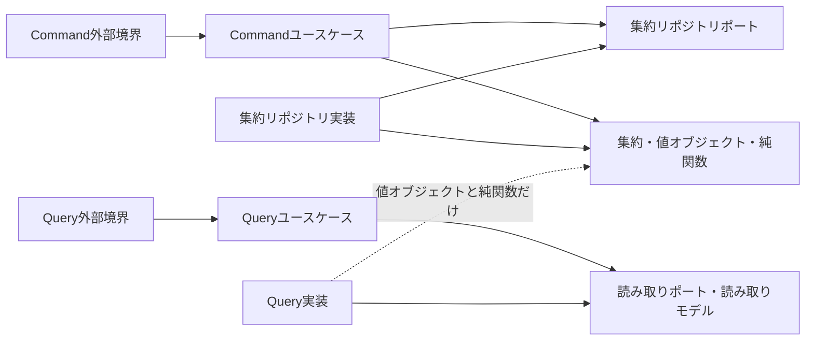

# 責務と整合性の判断規律

## 依存方向

業務判断は外部I/Fや永続化方式を知らない。ユースケースは業務操作を制御し、外側の実装をポート越しに利用する。外部境界、集約リポジトリ実装、Query実装は内側で定義された契約へ依存する。

矢印は論理的な依存を示す。特定言語のimportや物理配置を示さない。Query実装から集約へ向かう依存はない。値オブジェクトや純関数を借りても、集約の復元・操作は行わない。

## 論理責務

ドメインは集約の復元と状態変更の唯一の場所である。現在時刻の取得と識別子の採番は行わず、ユースケースから値として受け取る。

集約リポジトリは集約単位の永続化を担う。一覧、件数、検索、存在確認は集約の保存契約ではなく読み取り要求なのでQuery実装が担う。

Commandユースケースは外部入力を状態変更へつなぐ。必要な他集約の値、時刻、識別子を集め、トランザクションを開始・完了する。業務可否の判定自体は集約へ渡す。

Queryユースケースは検索条件などの読み取り入力を調整し、読み取りポートを呼び、平らな読み取りモデルを外部境界へ返す。読み取りポートと読み取りモデルはQueryユースケースが所有し、データ取得方式は所有しない。

外部境界は転送形式とユースケースの型を相互変換する。読み取りモデルから転送型への写しは項目コピー一回とし、計算を持ち込まない。

Query実装はユースケースが所有する読み取りポートを実装する。データ取得方式で導出できる集計は取得時に行い、業務計算は既存の値オブジェクトまたは純関数を利用する。戻り値は識別子と表示に必要な値だけを持つ平らな読み取りモデルであり、集約やエンティティを返さない。

## 不変条件の三分類

構造的条件は、一つの値が有効であるための条件である。予約時間帯の開始が終了より前という条件は、時間帯の値オブジェクト生成で守る。

事前条件は、操作時点の状態と材料で決まる。予約可能かどうかは、ユースケースが必要な材料を収集し、予約集約の操作が判定する。ユースケースが業務判断を複製しない。

集合的条件は、同時実行される複数の書き込みを含む集合全体で守る。予約枠の重複禁止はDBの宣言的制約を権威とし、集約リポジトリは制約違反を「枠が既に予約済み」という拒否へ翻訳する。選択したDBに必要な宣言的制約がない、または可否が不明な場合は、代替ロックを発明せず設計判断を止める。

## 複数集約の境界

他集約を読むだけなら、引き金となる集約のCommandユースケースが論理的に所有する。二つ以上の集約へ書く場合だけ、どの集約にも属さない横断調整責務とし、各集約リポジトリポートを利用する。

同期処理では、一つのユースケースが一つのトランザクションを所有する。先の集約操作が返した業務イベントを値として次の集約操作へ渡す。暗黙のイベント配送を使わない。

結果整合は、根拠資料の期待状態が時間差を明示する場合だけ採用する。発生元の変更とoutbox記録を同じトランザクションで保存し、別のユースケースが別トランザクションで処理する。

## 物理配置との境界

この規律が確定するのは、論理責務、集約または業務文脈による所有、依存方向、整合方式までである。package、directory、module、namespace、import pathは、対象言語の規約が確定済み論理責務を入力として決める。

典型例: 空き枠検索はQuery実装が取得・集計し、ユースケース所有の平らな読み取りモデルを返す。

似て非なる例: 予約確定前の「対象枠が利用可能」という材料取得は読み取りだが、予約集約の状態変更を開始するCommandユースケースの一部である。可否判定は取得側でなく集約が行う。

反例: 将来検索するかもしれないため、集約リポジトリへ汎用検索操作を追加する。集約永続化と読み取り要求を混ぜるため拒否する。

境界例: 二集約へ書く操作でも、同じ時点で成立するなら同期一トランザクションである。「後ほど処理される」という時間差が期待状態に追加された時点で、outboxを用いる結果整合の候補へ切り替わる。
